# Planungssystem – Prototyp zur Übergabe

Planung von **Ablesungen**, **Montagen** und **Aushängen** für einen Messdienst (Heizkostenverteiler,
Wasser-/Wärmezähler, Rauchwarnmelder). Dieser Prototyp zeigt, **wie wir arbeiten wollen**: alle Abläufe sind
klickbar, mit frei erfundenen Demodaten (240 Liegenschaften, 70 Montageaufträge, 11 Ableser/Monteure).

> **Was es ist:** ein lauffähiger, getesteter Prototyp (Django, ca. 20.000 Zeilen, 488 automatische Tests) –
> die „lebende Anforderung“ für das echte System.
> **Was es nicht ist:** an unsere echte Software angebunden, auf einem Server, mit echten Daten.

---

## 1. Vorführung starten

**Windows (einfachster Weg)**

1. Python 3.12 installieren (z. B. aus dem Microsoft Store).
2. `start_windows.bat` doppelklicken – beim ersten Mal wird alles eingerichtet, dann öffnet sich der Browser.
3. Vor einer Vorführung: `demo_vorbereiten_windows.bat` doppelklicken – setzt alle Demodaten frisch auf
   (mit Beispielen auf jeder Seite, Fahrpläne passend zum heutigen Tag).

**Linux / Mac / GitHub Codespaces**

```bash
python3.12 -m venv .venv && source .venv/bin/activate
pip install -r requirements.txt
cp .env.example .env                      # DJANGO_DEBUG=True für lokal
python manage.py demo_vorbereiten --password "Test-Passwort-2026"
python manage.py runserver                # http://127.0.0.1:8000
```

**Anmelden** – ein Test-Benutzer je Rolle, Passwort `Test-Passwort-2026`:

| Benutzer | Rolle | sieht / darf |
|---|---|---|
| `dispo_demo` | Disposition / Terminierung | alles planen: Fahrpläne, Wochenplanung, Aushänge, Rückmeldungen |
| `sachbearbeitung_demo` | Sachbearbeitung | Rückmeldungen bearbeiten, Unterlagen, Aushänge, Notizen |
| `ableser_demo` | Ableser/Monteur | nur **📱 Mein Tag** (Handy-Ansicht des eigenen Fahrplans) |
| `leitung_demo` | Leitung | alles ansehen, Übersicht/Zahlen, nichts ändern |
| `admin_demo` | Admin | alles + Verwaltung (Personen, Rollen, Preise) |

Ohne TomTom-Schlüssel läuft alles mit **geschätzten** Fahrzeiten (Luftlinie); Karten brauchen den Schlüssel.

---

## 2. Rundgang (ca. 15 Minuten)

| # | Wer | Was zeigen |
|---|---|---|
| 1 | `dispo_demo` | **☰ Menü** oben links: alle Seiten und Schnellfilter als Knöpfe |
| 2 | | **🏢 Liegenschaften**: Filter, Kacheln, Status direkt in der Tabelle ändern |
| 3 | | Liegenschaften ankreuzen → **🗺 Fahrplan erstellen** → Vorschau mit Zeiten, Warnungen, „Bist du sicher?“ |
| 4 | | **📅 Kalender**: Pläne je Person, auf anderen Tag ziehen, Seitenpanel mit Stopps |
| 5 | | **🗓 Wochenplanung**: die Woche für alle, von Hand verteilen (nichts automatisch) |
| 6 | `ableser_demo` (Handy-Breite) | **📱 Mein Tag**: Stopp für Stopp, ✓ fertig / ◐ teilweise / ✗ nicht erledigt, Problem melden |
| 7 | `dispo_demo` | **🧾 Rückmeldungen**: was nach den Terminen im Büro zu tun ist, Nachtermin vormerken |
| 8 | | **🛰 Wer ist wo?**: Karte, wo jeder laut Fahrplan gerade sein sollte (Schieberegler Uhrzeit) |
| 9 | | **📄 Aushänge**: je Fahrplan, was noch zu drucken ist → drucken (Firmen-Vorlage) → **🗺 Aushang-Route** |
| 10 | | **⚠ Konflikte**, **📄 Unterlagen (14-Tage-Frist)**, **📊 Übersicht** (+ Excel) |
| 11 | | **🕘 Verlauf**: wer hat wann was geändert |

---

## 3. Die Seiten

### 🏢 Liegenschaften
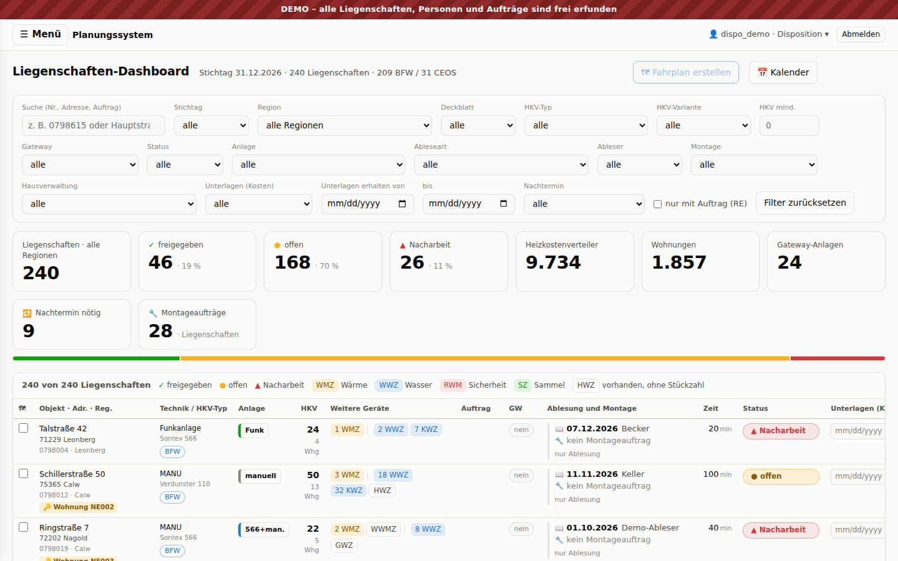
Alle Objekte mit Technik, Geräten, Ableseart, Status (offen / Nacharbeit / freigegeben), Stichtag,
Hausverwaltung, Unterlagen. Filtern und Sortieren laufen auf dem Server, die Filter stehen in der Adresse.

### ☰ Menü
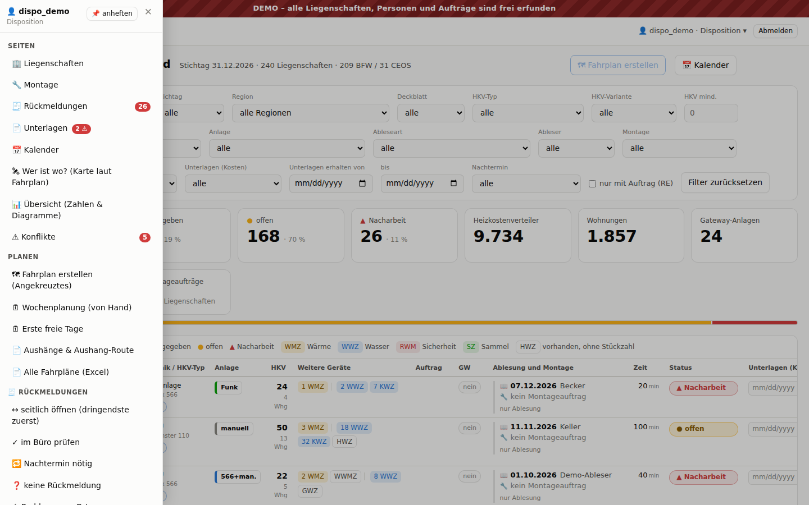
Alle Seiten, Aktionen und Schnellfilter – je nach Rolle. Zähler zeigen offene Rückmeldungen und Konflikte.

### 🔧 Montage
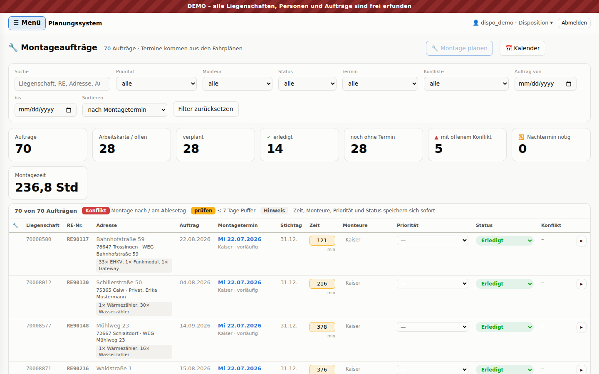
Montageaufträge (RE-Nummer) mit Positionen, Status, Wunschtermin, Konflikten; ankreuzen und als Fahrplan planen.
Admin: 💶 Material & Kosten.

### 📅 Kalender und Fahrplan
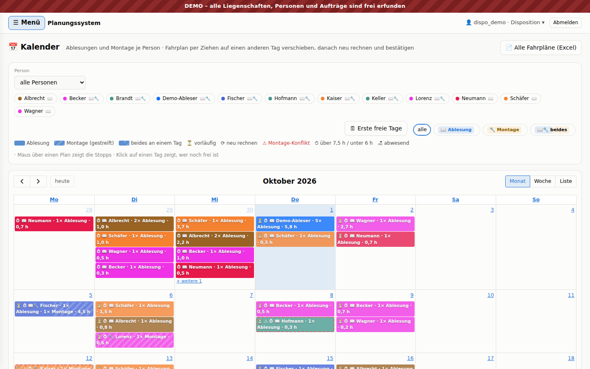
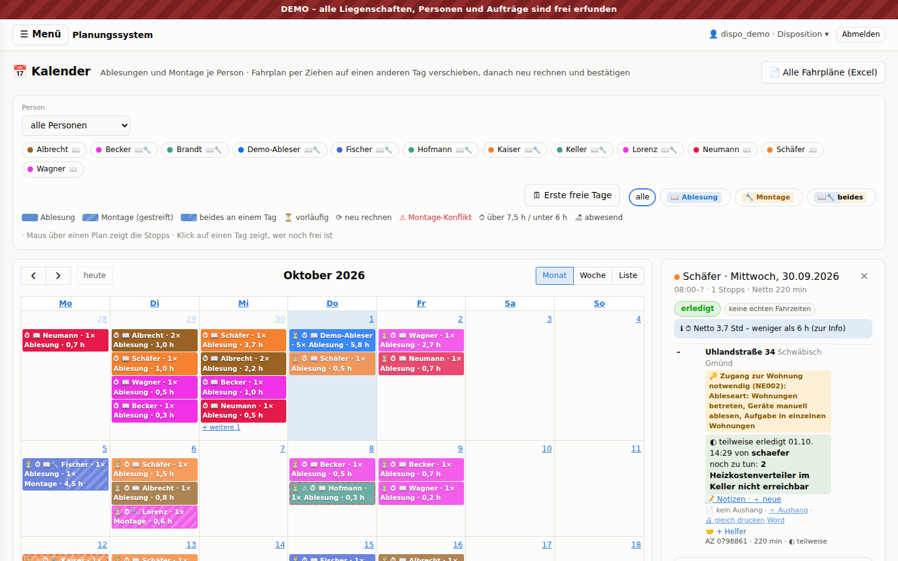
Ein Fahrplan = eine Person (oder ein Team) an einem Tag, mit Stopps in Reihenfolge, Fahrzeiten, Netto-Arbeitszeit
(Regel: 6–7,5 h). Zustände: ⏳ vorläufig → bestätigt → erledigt. Verschieben per Ziehen, danach neu rechnen.
Je Stopp: Notizen, Aushang, 🤝 Helfer, Ergebnis.

### 🗓 Wochenplanung
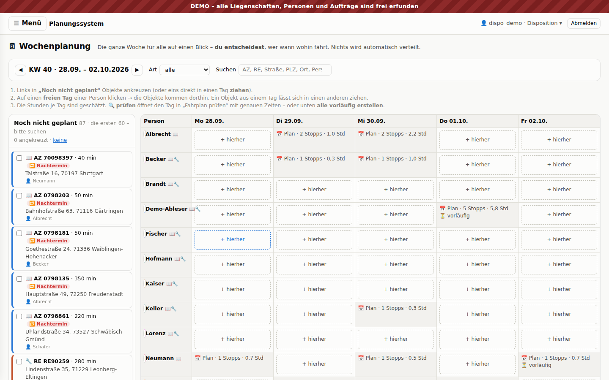
Links „noch nicht geplant“ (inkl. 🔁 Nachtermine), rechts Personen × Tage. **Bewusst von Hand** – das System
schlägt vor und warnt, entscheidet aber nicht.

### 📱 Mein Tag (Ableser/Monteur)
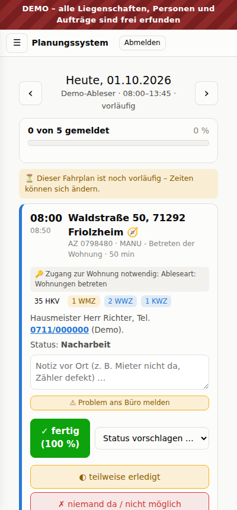

Der eigene Fahrplan auf dem Handy: Adresse (Navigation), Zugang/Schlüssel, Geräte, Notiz vor Ort,
Ergebnis melden. Das Büro sieht die Meldungen sofort.

### 🧾 Rückmeldungen
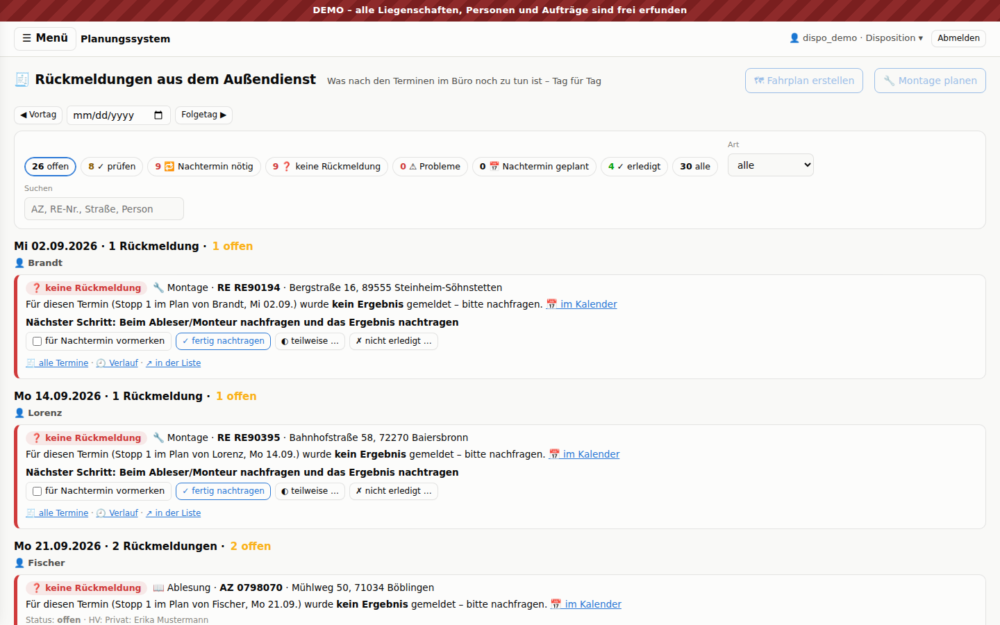
Arbeitsliste fürs Büro nach den Terminen: im Büro prüfen, 🔁 Nachtermin nötig, ❓ keine Rückmeldung (nachfragen,
nachtragen), ⚠ Probleme vor Ort. Ein Objekt behält alle Besuche (1. Termin, 2. Termin …).

### 🛰 Wer ist wo?
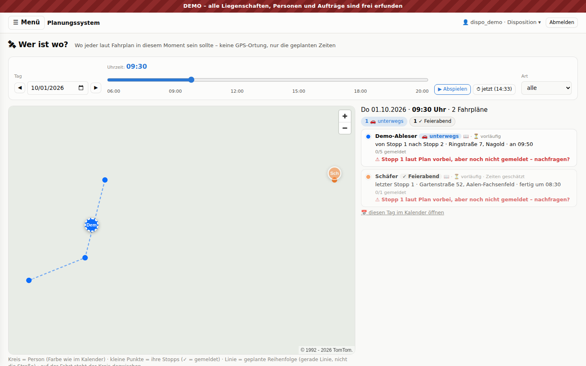
Kein GPS: zeigt, wo jeder **laut Fahrplan** zu einer Uhrzeit sein sollte (vor Ort / unterwegs / Feierabend).

### 📊 Übersicht
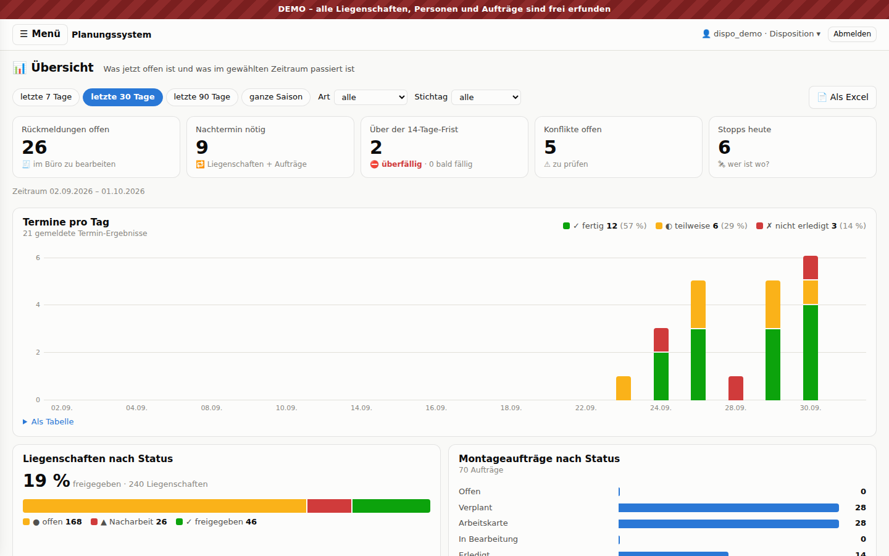
Zahlen und Diagramme für einen Zeitraum und je Stichtag (Abrechnungsperiode), als Excel.

### 📄 Aushänge und 🗺 Aushang-Route
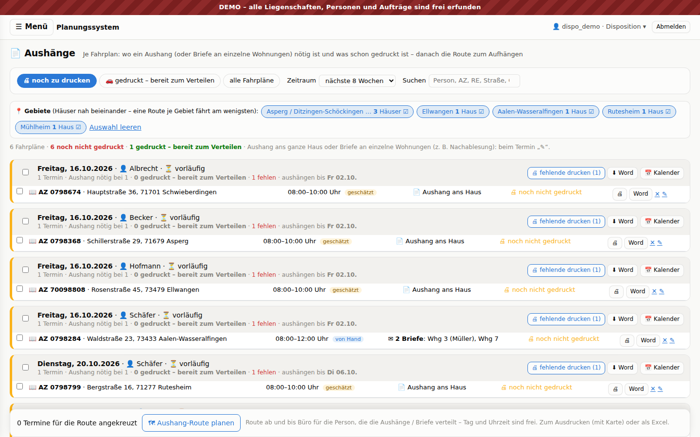
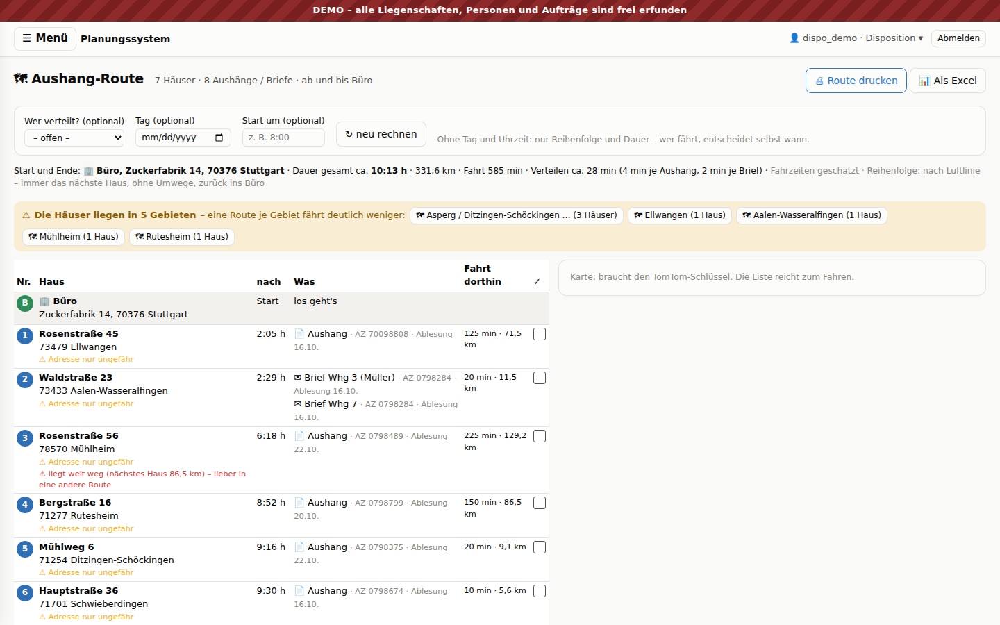
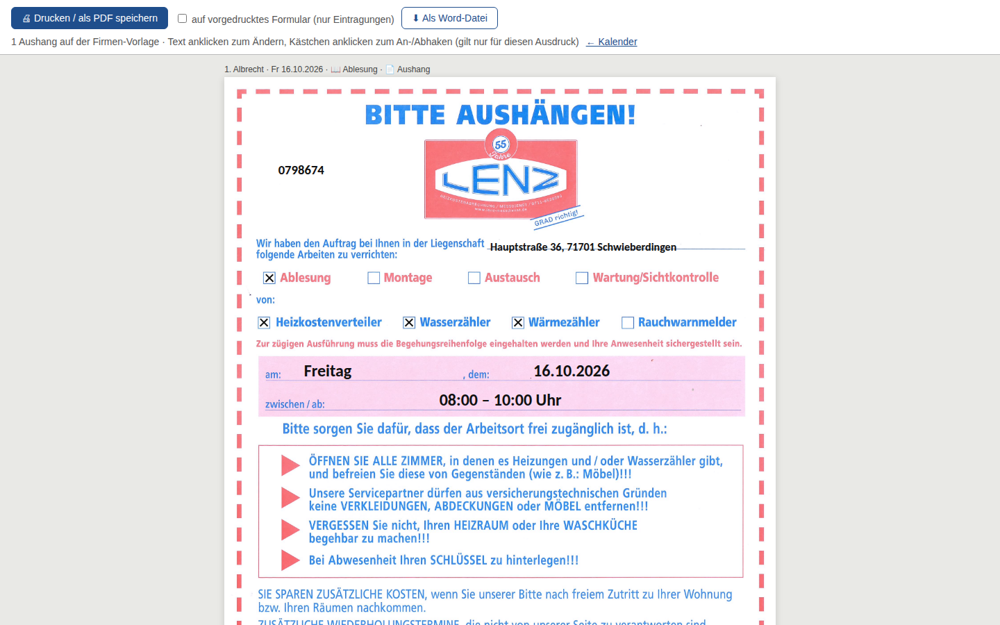

- Je Fahrplan sieht die Terminierung: wo ein Aushang nötig ist, was **noch zu drucken** und was
  **gedruckt – bereit zum Verteilen** ist. Frist: 14 Tage vor dem Termin.
- Aushang ans ganze Haus oder ✉ **Briefe an einzelne Wohnungen** (Nachablesung/Nachmontage), Zeitfenster aus dem
  Fahrplan oder von Hand.
- Druck auf der Firmen-Vorlage (auch als Word).
- **Aushang-Route** ab und bis Büro (Zuckerfabrik 14, Stuttgart): 4 min je Aushang, 2 min je Brief, kürzeste
  Reihenfolge (mit TomTom auf echten Straßen), 📍 Gebiete, Warnung „liegt weit weg“, drucken oder Excel.
  Tag und Uhrzeit sind frei – die Fahrer sind flexibel.

### ⚠ Konflikte und 📄 Unterlagen
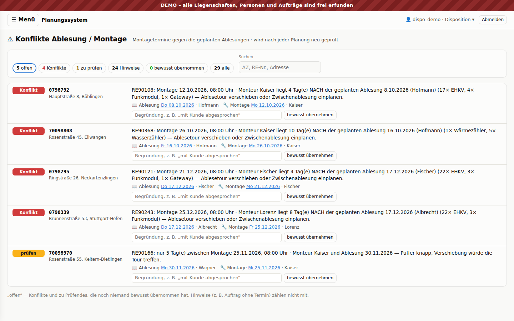
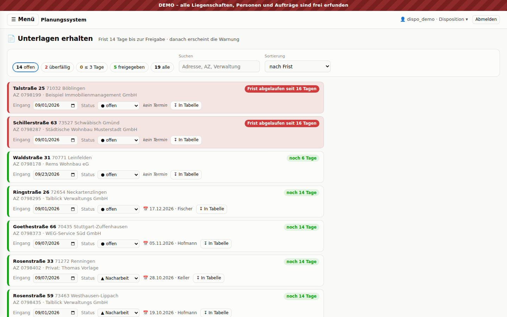
Konflikte zwischen Ablesung und Montage (z. B. Montage nach der Ablesung, am selben Tag, 1–7 Tage vorher,
Funk-Umrüstung bei manueller Ableseart). Unterlagen: Kostenbelege der Hausverwaltung mit 14-Tage-Frist.

---

## 4. Wichtige Regeln (fachlich)

Alle Regeln stehen als reine Python-Funktionen mit Tests in `*/rules/*.py` – das ist die genaueste Beschreibung:

| Datei | Regel |
|---|---|
| `planning/rules/working_time.py` | Arbeitstag 6–7,5 h netto, Fragen bei zu viel / zu wenig |
| `planning/rules/drive_time.py`, `ordering.py` | Fahrzeiten, Reihenfolge der Stopps |
| `planning/rules/availability.py` | Abwesenheit, erster freier Tag |
| `planning/rules/visits.py`, `followup.py` | Ergebnis, Nachtermin, Versuche, Rückmeldungen |
| `planning/rules/week.py`, `whereabouts.py`, `overview.py` | Wochenplanung, Wer ist wo, Übersicht |
| `buildings/rules/reading_time.py`, `installation_time.py` | Dauer je Ablesung / Montage |
| `buildings/rules/access.py`, `status.py`, `material.py` … | Zugang nötig, Status, Material & Kosten |
| `conflicts/rules.py` | Konflikte Ablesung ↔ Montage |
| `documents/notice_rules.py` | Aushang: 14-Tage-Frist, Zeitfenster, Briefe, Aushang-Route, Gebiete |

`planning/rules/autoplan.py` (automatisch planen) ist eingebaut, aber **ausgeschaltet** – gewünscht ist Planung
von Hand.

---

## 5. Technik

- **Python 3.12, Django 5, SQLite** (PostgreSQL per `.env` umschaltbar), Django-Templates + **HTMX 2** +
  Bootstrap 5, FullCalendar (Kalender), TomTom Maps SDK (Karten), openpyxl (Excel), Word-Vorlage für Aushänge.
- Pakete: `requirements.txt` (django-filter, django-simple-history, requests, openpyxl, pytest-django …).
- **Apps:** `core` (Rollen, Login, Menü), `buildings` (Liegenschaften, Hausverwaltungen, Montageaufträge,
  Import), `planning` (Personen, Abwesenheiten, Fahrpläne, Stopps, Besuche, TomTom), `conflicts`,
  `documents` (Unterlagen, Aushänge), `journal` (Notizen, Verlauf).
- **Datenmodell (Kern):** `Building` · `InstallationOrder` (+ Positionen) · `Employee` · `Absence` · `Tour`
  (Person + Tag) · `TourStop` (Ablesung / Montage / Hilfe, mit Aushang-Feldern) · `Visit` (Ergebnis je Termin) ·
  `Conflict` · `Note` · `Activity`. Änderungen werden mit django-simple-history protokolliert.
- **Sicherheit:** der TomTom-Schlüssel steht nur in `.env` auf dem Server; alle TomTom-Aufrufe (Routing,
  Geocoding, Kartenkacheln) gehen über unser Backend, nie aus dem Browser. Rollen und Rechte in `core/roles.py`.
- **Tests:** `pytest` (ca. 1 Minute, 488 Tests). Ausführliche technische Beschreibung je Funktion: `README.md`.

---

## 6. Was fürs echte System fehlt

| Thema | Stand im Prototyp | Für den Betrieb |
|---|---|---|
| Daten | Demodaten aus HTML-Dateien | Anbindung/Import aus unserer bestehenden Software (Liegenschaften, Mieter, Geräte, Aufträge) – größte offene Frage |
| Server | läuft lokal | Hosting (in Deutschland), HTTPS, Updates, Überwachung |
| Datenbank | SQLite | PostgreSQL, tägliche Sicherung, Wiederherstellung getestet |
| Anmeldung | Django-Benutzer | ggf. Firmen-Login (Microsoft/SSO), Passwort-Regeln |
| Fremd-Server | Bootstrap/HTMX/Kalender/Karte per CDN | Dateien selbst ausliefern (DSGVO) |
| TomTom | Test-Schlüssel / ohne | Vertrag/Lizenz für den Firmeneinsatz |
| Datenschutz | erfundene Daten | Mieterdaten = personenbezogen: AV-Vertrag, Verarbeitungsverzeichnis, Löschfristen |
| Mein Tag | Web-Seite | offline-fähig? App? Fotos? |

**Fragen fürs Gespräch:** Wird der Prototyp weiterentwickelt oder neu gebaut (Regeln + Tests übernehmen)?
Wie kommen die Daten aus unserer Software hinein und wieder zurück? Wer betreibt und pflegt das System?
